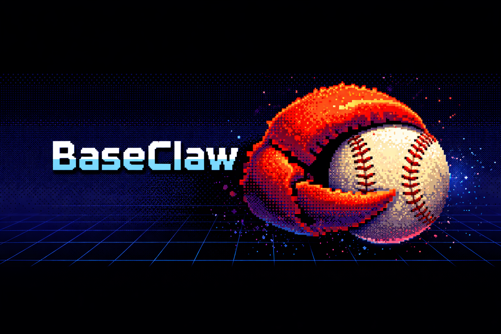

<p align="center">
  
</p>

# BaseClaw

Fantasy Baseball MCP Server for Claude. Manage your Yahoo Fantasy Baseball league through natural conversation or let an AI agent run it autonomously — optimize lineups, analyze trades, scout opponents, find waiver pickups, and make roster moves, all backed by real-time data and rendered in rich inline UIs. Works with Claude Code, Claude Desktop, Claude.ai, and agent orchestrators like [OpenClaw](https://openclaw.com) for fully hands-free team management.

**Built with:** [yahoo_fantasy_api](https://github.com/uberfastman/yahoo_fantasy_api) | [pybaseball](https://github.com/jldbc/pybaseball) | [MLB-StatsAPI](https://github.com/toddrob99/MLB-StatsAPI) | [MCP Apps (ext-apps)](https://github.com/anthropics/model-context-protocol/tree/main/packages/ext-apps) | [Playwright](https://playwright.dev/) | [MCP SDK](https://github.com/modelcontextprotocol/typescript-sdk)

## Table of Contents

- [What It Does](#what-it-does)
- [Quick Start](#quick-start)
- [Connecting to Claude](#connecting-to-claude)
- [Agent Orchestrators (OpenClaw)](#agent-orchestrators-openclaw)
- [MCP Tools](#mcp-tools)
- [CLI Commands](#cli-commands)
- [Architecture](#architecture)
- [Environment Variables](#environment-variables)
- [Optional Config Files](#optional-config-files)
- [Project Files](#project-files)

## What It Does

This MCP server gives Claude direct access to your Yahoo Fantasy Baseball league, real-time MLB data, and advanced analytics. Instead of switching between Yahoo's app, Baseball Savant, Reddit, and spreadsheets, you just talk to Claude — or let an AI agent handle it all automatically.

**Two ways to use it:**

**Conversational** — Ask Claude directly:
- "Who should I pick up this week to help my batting average?"
- "Is it worth trading Soto for two mid-tier pitchers?"
- "Set my lineup for today — bench anyone without a game"
- "Who are the best streaming pitchers for next week?"

**Autonomous** — Connect to an agent orchestrator like [OpenClaw](https://openclaw.com) and your team manages itself:
- Daily: auto-sets optimal lineups, checks injuries, handles IL moves
- Weekly: scouts your matchup opponent, finds waiver wire targets, identifies trade opportunities
- On schedule: cron jobs trigger the agent at times you choose — no manual interaction needed
- Smart decisions: the agent follows configurable rules — auto-executes safe moves (lineup optimization), reports risky ones (trades) for your approval

### How It Works

Claude calls the MCP tools to pull live data, run analysis, and take action on your behalf. Behind the scenes:

1. **Yahoo Fantasy API** — Your roster, standings, matchups, free agents, transactions, and league settings come from Yahoo's OAuth API in real time. Every tool call fetches current data, not cached snapshots.

2. **Analytics engine** — Z-score valuations tuned to your league's stat categories, powered by consensus projections (Steamer + ZiPS + Depth Charts blended) auto-fetched from FanGraphs, with park factor adjustments, rest-of-season valuation tracking, and in-season blending of projections + live stats weighted by games played. Category gap analysis, punt strategy advisor, playoff path planner, trade package builder, FAAB bid recommendations, and a trade finder that scans every team for complementary deals.

3. **Player intelligence** — Every player surface is enriched with Statcast data (xwOBA, xERA, exit velocity, barrel rate, percentile rankings, pitch arsenal, batted ball profile), platoon splits (vs LHP/RHP), historical Statcast comparisons, arsenal change detection, recent trend splits (7/14/30 day), plate discipline metrics (FanGraphs), Reddit sentiment from r/fantasybaseball, and MLB transaction alerts. Expensive API calls are cached with configurable TTL. Before the season starts, Savant data automatically falls back to the prior year so intel surfaces stay populated during spring training.

4. **Browser automation** — Write operations (add, drop, trade, lineup changes) use Playwright to automate the Yahoo Fantasy website directly, since Yahoo's API no longer grants write scope to new developer apps. Read operations still use the fast OAuth API.

5. **Inline UI apps** — Tool results aren't just text. Nine Preact + Tailwind + Recharts HTML apps with 62 views render interactive tables, charts, radar plots, heatmaps, and dashboards directly inside Claude's response using MCP Apps (`@modelcontextprotocol/ext-apps`).

6. **Workflow tools for agents** — Eleven aggregated tools (`yahoo_morning_briefing`, `yahoo_game_day_manager`, `yahoo_trade_pipeline`, etc.) each combine 5-7+ individual API calls server-side and return concise, decision-ready output in a single tool call. Designed for autonomous agents that need to minimize token usage and tool call count — a full daily routine takes just 2-3 tool calls instead of 15+.

### Data Flow

When you ask Claude a question, here's what happens:

```
You: "Should I drop Player X for Player Y?"

Claude calls:
  1. yahoo_roster          → your current roster + intel overlays
  2. yahoo_category_check  → your weak/strong categories
  3. yahoo_value (X)       → Player X z-score breakdown
  4. yahoo_value (Y)       → Player Y z-score breakdown
  5. yahoo_category_simulate → projected category rank changes

Claude synthesizes all 5 results and gives you a recommendation
with specific category-level reasoning.
```

Claude decides which tools to call and in what order based on your question. Complex questions may chain 3-8 tool calls. Simple lookups ("show my roster") are a single call.

## Quick Start

### One-command install

```bash
curl -fsSL https://raw.githubusercontent.com/jweingardt12/baseclaw/main/scripts/install.sh | bash
```

Or tell your OpenClaw agent: **"install github.com/jweingardt12/baseclaw"**

**ClawHub:** `clawhub install baseclaw` — uses `SKILL.md` for automated setup.

The installer handles everything: pulls the Docker image, prompts for your Yahoo API credentials, starts the container, runs Yahoo OAuth discovery, and configures your MCP client (Claude Code, Claude Desktop, or OpenClaw).

**Prerequisites:** Docker and `docker compose`

**Uninstall:**
```bash
curl -fsSL https://raw.githubusercontent.com/jweingardt12/baseclaw/main/scripts/install.sh | bash -s -- --uninstall
```

<details>
<summary><strong>Manual setup</strong></summary>

#### 1. Get Yahoo API credentials

Go to [developer.yahoo.com/apps/create](https://developer.yahoo.com/apps/create), create an app with **Fantasy Sports** read permissions and `oob` as the redirect URI. Copy the consumer key and secret.

#### 2. Configure and run

```bash
cp docker-compose.example.yml docker-compose.yml
cp .env.example .env
# Edit .env — set YAHOO_CONSUMER_KEY and YAHOO_CONSUMER_SECRET
mkdir -p config data
docker compose up -d
```

The container auto-generates `config/yahoo_oauth.json` from your env vars on first start. You don't need to create this file manually.

#### 3. Find your league and team IDs

On the first API call, Yahoo will prompt you to authorize the app. Run `discover` to trigger auth and find your IDs in one step:

```bash
./yf discover
```

Follow the prompt — open the URL, log in, paste the verification code. The command then prints your current-season leagues and teams:

```
Your 469 MLB Fantasy Leagues:

  1. My League Name
     Season: 2026  |  Teams: 12
     LEAGUE_ID=469.l.12345
     TEAM_ID=469.l.12345.t.7  (My Team Name)

Add these to your .env file:

  LEAGUE_ID=469.l.12345
  TEAM_ID=469.l.12345.t.7
```

Copy the values into `.env`, then restart:

```bash
docker compose up -d
```

Tokens refresh automatically after the initial authorization.

#### 4. Connect to Claude

Add to your `.mcp.json` (Claude Code) or `claude_desktop_config.json` (Claude Desktop):

```json
{
  "mcpServers": {
    "baseclaw": {
      "command": "docker",
      "args": ["exec", "-i", "baseclaw", "node", "/app/mcp-apps/dist/main.js", "--stdio"]
    }
  }
}
```

That's it. Everything runs inside Docker — no local dependencies beyond Docker itself.

</details>

### 5. Enable write operations (optional)

To let Claude make roster moves (add, drop, trade, set lineup), set `ENABLE_WRITE_OPS=true` in `.env`, rebuild with `docker compose up -d`, and set up a browser session:

```bash
./yf browser-login
```

This opens a browser — log into Yahoo manually. The session saves to `config/yahoo_session.json` and lasts 2-4 weeks.

### 6. Enable preview dashboard (optional)

To browse all UI views in your browser, set `ENABLE_PREVIEW=true` in `.env` and rebuild:

```bash
docker compose up -d --build
```

Then open `http://localhost:4951/preview` (or your `MCP_SERVER_URL/preview`). The preview app lets you switch between mock and live data, toggle dark/light mode, and explore every view the MCP server can render.

## Connecting to Claude

The MCP server supports two transports: **stdio** (local, for Claude Code and Claude Desktop) and **Streamable HTTP** (remote, for Claude.ai). Both use the same tools and backend.

**Claude Code / Claude Desktop** — Add the config from [Quick Start step 4](#4-connect-to-claude) to `.mcp.json` (Claude Code) or `claude_desktop_config.json` (Claude Desktop). Config file paths for Claude Desktop:
- **macOS**: `~/Library/Application Support/Claude/claude_desktop_config.json`
- **Windows**: `%APPDATA%\Claude\claude_desktop_config.json`

Restart the app after saving.

### Claude.ai (remote access)

Claude.ai can't run local processes, so the MCP server needs to be reachable over the internet. You need a machine running Docker, a domain name, and a reverse proxy for HTTPS.

**1. Set env vars** in `.env`:

```bash
MCP_SERVER_URL=https://your-domain.com
MCP_AUTH_PASSWORD=your_secure_password
```

`MCP_SERVER_URL` must match exactly what Claude.ai connects to — it's used to generate OAuth callback URLs.

**2. Set up a reverse proxy** to forward HTTPS to the container's port 4951:

<details>
<summary>Caddy (automatic HTTPS)</summary>

```
your-domain.com {
    reverse_proxy localhost:4951
}
```
</details>

<details>
<summary>nginx</summary>

```nginx
server {
    listen 443 ssl;
    server_name your-domain.com;
    ssl_certificate /path/to/cert.pem;
    ssl_certificate_key /path/to/key.pem;

    location / {
        proxy_pass http://localhost:4951;
        proxy_set_header Host $host;
        proxy_set_header X-Forwarded-For $proxy_add_x_forwarded_for;
        proxy_set_header X-Forwarded-Proto $scheme;
    }
}
```
</details>

Cloudflare Tunnel, Tailscale Funnel, and Pangolin also work.

**3. Rebuild and connect:**

```bash
docker compose up -d
```

In Claude.ai, go to Settings > Integrations > Add MCP Server, enter `https://your-domain.com/mcp`. You'll be redirected to a login page — enter your `MCP_AUTH_PASSWORD` to authorize. The token persists across sessions.

<details>
<summary>How the auth flow works</summary>

The MCP server implements MCP OAuth 2.1 using `@modelcontextprotocol/sdk`. No third-party auth provider needed — the password is checked directly against `MCP_AUTH_PASSWORD`.

```
Claude.ai → GET /mcp → 401 Unauthorized
         → discovers OAuth metadata at /.well-known/oauth-authorization-server
         → redirects user to /authorize → /login (password form)
         → user enters password → /login/callback validates it
         → issues authorization code → Claude.ai exchanges for bearer token
         → GET/POST /mcp with Authorization: Bearer <token> → tools work
```
</details>

## Agent Orchestrators (OpenClaw)

Connect BaseClaw to an agent orchestrator and your fantasy team manages itself. The agent sets optimal lineups every morning, monitors injuries, finds waiver wire pickups, scouts opponents, and identifies trade opportunities — all on autopilot with no manual interaction required.

Any AI agent orchestrator that supports MCP can use BaseClaw (OpenClaw, LangChain, CrewAI, etc.). The setup below uses [OpenClaw](https://openclaw.com) as an example.

### What the Agent Does

The agent operates as an autonomous fantasy GM with a daily and weekly routine:

**Every morning (9am):**
1. Calls `yahoo_morning_briefing` — gets injuries, lineup issues, live matchup scores, category strategy, opponent moves, and top waiver targets in one call
2. Calls `yahoo_auto_lineup` — benches off-day players, starts active bench players, flags injured starters
3. Executes any critical action items (IL moves, pending trade responses)
4. Reports a 2-3 sentence summary of actions taken

**Pre-lock check (10:30am):**
1. Calls `yahoo_game_day_manager` — schedule, weather risks, late scratches, lineup optimization, and streaming recommendations
2. Makes last-minute adjustments before lineups lock at first pitch

**Every Monday (8am):**
1. Calls `yahoo_league_landscape` — standings, playoff projections, rival activity, trade opportunities
2. Calls `yahoo_matchup_strategy` — category-by-category game plan for this week's opponent
3. Reports your opponent, which categories to target/concede, and top recommended actions

**Tuesday evening (8pm):**
1. Calls `yahoo_waiver_deadline_prep` — ranks waiver candidates with FAAB bids and simulated category impact
2. Submits top claims if they show strong net improvement

**Thursday (9am):**
1. Calls `yahoo_streaming` — finds two-start pitchers and favorable streaming matchups
2. Executes the top streaming add if it improves counting stats

**Weekend (Saturday 9am):**
1. Calls `yahoo_roster_health_check` — audits for injured starters, IL-eligible players not on IL, bust candidates, off-day issues
2. Reports any critical or warning issues found

**End of week (Sunday 9pm):**
1. Calls `yahoo_weekly_digest` — matchup result, transactions, key performers, standings movement
2. Produces a prose narrative summary of the week

**Monthly (1st of month):**
1. Calls `yahoo_season_checkpoint` — rank, playoff probability, category trajectory, trade targets
2. Reports strategic assessment with improving/declining categories and recommended moves

### Decision Tiers

The agent follows configurable rules about what it can do autonomously vs. what requires your approval:

| Tier | Actions | Agent Behavior |
|------|---------|----------------|
| **Auto-execute** | Lineup optimization, IL moves | Safe and idempotent — the agent acts immediately |
| **Execute + report** | Waiver pickups, streaming adds, obvious drops | High-confidence moves — the agent acts and tells you what it did |
| **Report + wait** | Trades, dropping regular starters, large FAAB bids | The agent recommends but waits for your approval |

These tiers are defined in the agent persona file (`AGENTS.md`) and can be customized to match your comfort level.

### Setup with OpenClaw

The one-command installer handles OpenClaw configuration automatically if it detects OpenClaw on your system. To set it up manually:

**1. Ensure the Docker container is running:**

```bash
docker compose up -d
```

**2. Copy the config files:**

```bash
cp openclaw-config.yaml /path/to/openclaw/config/
cp AGENTS.md /path/to/openclaw/config/
cp openclaw-cron-examples.json /path/to/openclaw/config/
```

**3. Edit `openclaw-config.yaml`** — the default connects via stdio through Docker:

```yaml
agents:
  - id: fantasy-gm
    model: anthropic/claude-sonnet-4-5
    persona: ./AGENTS.md
    mcp_servers:
      - name: baseclaw
        command: docker
        args: [exec, -i, baseclaw, node, /app/mcp-apps/dist/main.js, --stdio]
        env:
          ENABLE_WRITE_OPS: "true"
    schedules: ./openclaw-cron-examples.json
```

Key configuration:
- **`persona: ./AGENTS.md`** — The agent persona teaches the agent league-specific strategy, daily/weekly routines, which workflow tools to call, and the decision tiers above. Customize this file to adjust the agent's behavior.
- **`ENABLE_WRITE_OPS: "true"`** — Required for the agent to make roster moves. Without this, the agent can only read data and report recommendations.
- **`schedules`** — Points to the cron job definitions. Edit `openclaw-cron-examples.json` to change times, timezone, or add/remove scheduled tasks.

**4. Start the agent:**

```bash
openclaw start
```

### Cron Schedule

The default schedule (all times Eastern, configurable):

| Schedule | Task | Tools Called |
|----------|------|-------------|
| Daily 9am | Lineup + briefing | `yahoo_morning_briefing` + `yahoo_auto_lineup` |
| Daily 10:30am | Pre-lock check | `yahoo_game_day_manager` |
| Monday 8am | Matchup plan | `yahoo_league_landscape` + `yahoo_matchup_strategy` |
| Tuesday 8pm | Waiver deadline prep | `yahoo_waiver_deadline_prep` |
| Thursday 9am | Streaming check | `yahoo_streaming` |
| Saturday 9am | Roster audit | `yahoo_roster_health_check` |
| Sunday 9pm | Weekly digest | `yahoo_weekly_digest` |
| 1st of month 10am | Season checkpoint | `yahoo_season_checkpoint` |

Each cron job runs in an isolated session, calls the specified tools, and produces a concise report. Edit `openclaw-cron-examples.json` to customize:

```json
{
  "name": "Daily lineup + morning briefing",
  "schedule": { "kind": "cron", "expr": "0 9 * * *", "tz": "America/New_York" },
  "sessionTarget": "isolated",
  "payload": {
    "kind": "agentTurn",
    "message": "Daily routine. Call yahoo_morning_briefing, then yahoo_auto_lineup. Execute any priority-1 action items. Report actions taken in 2-3 sentences."
  }
}
```

### Workflow Tools

Eleven aggregated tools designed for autonomous agents. Each combines 5-7+ individual API calls server-side and returns concise, decision-ready output — minimizing token usage and tool call count. These tools are available to all clients (Claude Code, Claude.ai, agent orchestrators).

| Tool | Aggregates | Use Case |
|------|-----------|----------|
| `yahoo_morning_briefing` | injury_report + lineup_optimize + matchup + strategy + whats_new + waiver_analyze x2 | Daily situational awareness |
| `yahoo_league_landscape` | standings + season_pace + power_rankings + league_pulse + transactions + trade_finder + scoreboard | Weekly strategic planning |
| `yahoo_roster_health_check` | injury_report + lineup_optimize + roster + intel/busts | Roster audit |
| `yahoo_waiver_recommendations` | category_check + waiver_analyze x2 + roster | Decision-ready waiver picks |
| `yahoo_auto_lineup` | injury_report + lineup_optimize (apply) | Daily lineup optimization |
| `yahoo_trade_analysis` | value + trade_eval + intel/player | Trade evaluation by name |
| `yahoo_game_day_manager` | schedule + weather + injury_report + lineup_optimize + streaming | Game-day pipeline |
| `yahoo_waiver_deadline_prep` | category_check + waiver_analyze x2 + category_simulate + injury_report | Pre-deadline waiver prep |
| `yahoo_trade_pipeline` | trade_finder + value + category_simulate + trade_eval | End-to-end trade search |
| `yahoo_weekly_digest` | standings + my_matchup + transactions + whats_new + roster_stats + achievements | Weekly summary narrative |
| `yahoo_season_checkpoint` | standings + season_pace + punt_advisor + playoff_planner + category_trends + trade_finder | Monthly strategic assessment |

### Agent Persona

The `AGENTS.md` file defines the agent's identity and behavior. It includes:

- **League awareness** — On first session, the agent learns your league's format, team count, scoring categories, and roster rules
- **Strategy principles** — Target close categories, concede lost causes, stream pitchers for counting stats, monitor closer situations, trade from surplus to improve weaknesses
- **Season phase strategy** — Early (build depth, stream aggressively), mid (trade for balance, buy low), late (playoff positioning, closer monitoring)
- **Multi-step decision trees** — Injury response pipelines, trade search workflows, waiver deadline claim chains
- **FAAB management** — Budget pacing, bid philosophy, emergency reserves
- **Competitive intelligence** — Track rival managers' activity, react to opponent moves, check standings implications before trades
- **Token efficiency** — Always use workflow tools over individual tools when possible, keep reports concise

You can customize `AGENTS.md` to adjust the agent's strategy, risk tolerance, or reporting style.

### Health Check

The server exposes a `GET /health` endpoint (unauthenticated) that returns `{ ok: true, writes_enabled: bool }` for monitoring uptime and verifying write operations are enabled.

## MCP Tools

113 total tools (93 read-only + 15 write operations + 5 workflow) across 10 tool files, each with rich inline HTML UI apps rendered directly in Claude.

<details>
<summary><strong>Roster Management</strong> (16 tools)</summary>

| Tool | Description |
|------|-------------|
| `yahoo_roster` | Show current fantasy roster with positions and eligibility |
| `yahoo_free_agents` | List top free agents (batters or pitchers) |
| `yahoo_search` | Search for a player by name among free agents |
| `yahoo_who_owns` | Check who owns a specific player by player ID |
| `yahoo_percent_owned` | Ownership percentage for specific players across Yahoo |
| `yahoo_add` | Add a free agent to your roster |
| `yahoo_drop` | Drop a player from your roster |
| `yahoo_swap` | Atomic add+drop: add one player and drop another |
| `yahoo_waiver_claim` | Submit a waiver claim with optional FAAB bid |
| `yahoo_waiver_claim_swap` | Submit a waiver claim + drop with optional FAAB bid |
| `yahoo_browser_status` | Check if the browser session for write operations is valid |
| `yahoo_change_team_name` | Change your fantasy team name |
| `yahoo_player_stats` | Player fantasy stats for any period (season, week, date, last 7/14/30 days) |
| `yahoo_waivers` | Players currently on waivers (in claim period, not yet free agents) |
| `yahoo_all_rostered` | All rostered players across the league with team ownership |
| `yahoo_change_team_logo` | Change your fantasy team logo (PNG/JPG image) |

</details>

<details>
<summary><strong>League & Standings</strong> (11 tools)</summary>

| Tool | Description |
|------|-------------|
| `yahoo_standings` | League standings with win-loss records |
| `yahoo_matchups` | Weekly H2H matchup pairings |
| `yahoo_scoreboard` | Live scoring overview for the current week |
| `yahoo_my_matchup` | Detailed H2H matchup with per-category comparison |
| `yahoo_info` | League settings, team info, waiver priority, and FAAB budget |
| `yahoo_transactions` | Recent league transactions (add, drop, trade) |
| `yahoo_stat_categories` | League scoring categories |
| `yahoo_transaction_trends` | Most added and most dropped players across Yahoo |
| `yahoo_league_pulse` | League activity — moves and trades per team |
| `yahoo_power_rankings` | Teams ranked by estimated roster strength |
| `yahoo_season_pace` | Projected season pace, playoff probability, and magic numbers |

</details>

<details>
<summary><strong>In-Season Management</strong> (32 tools)</summary>

| Tool | Description |
|------|-------------|
| `yahoo_lineup_optimize` | Optimize daily lineup (bench off-day players, start active ones) |
| `yahoo_category_check` | Your rank in each stat category vs the league |
| `yahoo_injury_report` | Check roster for injured players and suggest IL moves |
| `yahoo_waiver_analyze` | Score free agents by how much they'd improve your weakest categories |
| `yahoo_streaming` | Recommend streaming pitchers by schedule and two-start potential |
| `yahoo_trade_eval` | Evaluate a trade with value comparison and grade |
| `yahoo_daily_update` | Run all daily checks (lineup + injuries) |
| `yahoo_scout_opponent` | Scout current matchup opponent — strengths, weaknesses, counter-strategies |
| `yahoo_category_simulate` | Simulate category rank impact of adding a player |
| `yahoo_matchup_strategy` | Category-by-category game plan to maximize matchup wins |
| `yahoo_set_lineup` | Move specific player(s) to specific position(s) |
| `yahoo_pending_trades` | View all pending incoming and outgoing trade proposals |
| `yahoo_propose_trade` | Propose a trade to another team |
| `yahoo_accept_trade` | Accept a pending trade |
| `yahoo_reject_trade` | Reject a pending trade |
| `yahoo_whats_new` | Digest of injuries, pending trades, league activity, trending pickups, prospect call-ups |
| `yahoo_trade_finder` | Scan the league for complementary trade partners and suggest packages |
| `yahoo_week_planner` | Games-per-day grid with heatmap for your roster (off-days, two-start pitchers) |
| `yahoo_closer_monitor` | Monitor closer situations — your closers, available closers, saves leaders |
| `yahoo_pitcher_matchup` | Pitcher matchup quality for your SPs based on opponent batting stats |
| `yahoo_roster_stats` | Per-player stat breakdown for your roster (season totals or specific week) |
| `yahoo_faab_recommend` | FAAB bid recommendation based on budget, league spending pace, and player value |
| `yahoo_ownership_trends` | Ownership trend data from season.db — accumulates as you use waiver/trending tools |
| `yahoo_category_trends` | Category rank trends over time with Recharts line chart visualization |
| `yahoo_punt_advisor` | Analyze roster construction and recommend categories to target vs. punt |
| `yahoo_il_stash_advisor` | Cross-reference injury timelines with playoff schedule and player upside |
| `yahoo_optimal_moves` | Multi-move optimizer — best add/drop sequence to maximize net roster z-score |
| `yahoo_playoff_planner` | Calculate category gaps to playoff threshold and recommend specific moves |
| `yahoo_trash_talk` | Generate league-appropriate banter based on matchup context |
| `yahoo_rival_history` | Head-to-head record vs each manager (current season, or all-time with league-history.json) |
| `yahoo_achievements` | Track milestones — best ERA week, longest win streak, most moves |
| `yahoo_weekly_narrative` | Auto-generated weekly recap with category analysis and season story arc |

</details>

<details>
<summary><strong>Valuations</strong> (6 tools)</summary>

| Tool | Description |
|------|-------------|
| `yahoo_rankings` | Top players ranked by z-score value (consensus projections, park-adjusted) |
| `yahoo_compare` | Compare two players side by side with z-score breakdowns |
| `yahoo_value` | Full z-score breakdown for a player across all categories |
| `yahoo_projections_update` | Force-refresh projections from FanGraphs (consensus, steamer, zips, or fangraphsdc) |
| `yahoo_zscore_shifts` | Players whose z-score value has shifted most since draft day (rising/falling) |
| `yahoo_projection_disagreements` | Players where projection systems disagree most — draft sleeper/bust signals |

</details>

<details>
<summary><strong>Draft</strong> (5 tools)</summary>

| Tool | Description |
|------|-------------|
| `yahoo_draft_status` | Current draft status — picks made, your round, roster composition |
| `yahoo_draft_recommend` | Draft pick recommendation with top available hitters and pitchers by z-score |
| `yahoo_draft_cheatsheet` | Draft strategy cheat sheet with round-by-round targets |
| `yahoo_best_available` | Best available players ranked by z-score |
| `yahoo_draft_board` | Visual draft board tracker — grid of picks by team and round |

</details>

<details>
<summary><strong>Intelligence</strong> (8 tools)</summary>

| Tool | Description |
|------|-------------|
| `fantasy_player_report` | Deep-dive Statcast radar chart + SIERA (expected ERA) + platoon splits + arsenal + trends + Reddit buzz |
| `fantasy_breakout_candidates` | Players whose expected stats (xwOBA) exceed actual — positive regression candidates |
| `fantasy_bust_candidates` | Players whose actual stats exceed expected (xwOBA) — negative regression candidates |
| `fantasy_reddit_buzz` | What r/fantasybaseball is talking about — hot posts, trending topics |
| `fantasy_trending_players` | Players with rising buzz on Reddit |
| `fantasy_prospect_watch` | Recent MLB prospect call-ups and roster moves |
| `fantasy_transactions` | Recent fantasy-relevant MLB transactions (IL, call-up, DFA, trade) |
| `yahoo_statcast_history` | Compare a player's Statcast profile now vs. 30/60 days ago |

</details>

<details>
<summary><strong>Analytics & Strategy</strong> (7 tools)</summary>

| Tool | Description |
|------|-------------|
| `fantasy_player_news` | Latest news and updates for a specific player |
| `fantasy_news_feed` | Fantasy-relevant news feed across all players |
| `fantasy_probable_pitchers` | Probable pitchers for upcoming games |
| `fantasy_schedule_analysis` | Schedule-based analysis for streaming and lineup planning |
| `fantasy_category_impact` | Projected category rank impact of a roster move |
| `fantasy_regression_candidates` | Players likely to regress positively or negatively based on advanced stats |
| `fantasy_player_tier` | Player tier classification within position group |

</details>

<details>
<summary><strong>MLB Data</strong> (9 tools)</summary>

| Tool | Description |
|------|-------------|
| `mlb_teams` | List all MLB teams with abbreviations |
| `mlb_roster` | MLB team roster by abbreviation (NYY, LAD, etc.) |
| `mlb_player` | MLB player info by Stats API player ID |
| `mlb_stats` | Player season stats by Stats API player ID |
| `mlb_injuries` | Current MLB injuries across all teams |
| `mlb_standings` | MLB division standings |
| `mlb_schedule` | MLB game schedule (today or specific date) |
| `mlb_draft` | MLB draft picks by year |
| `yahoo_weather` | Real-time weather (temperature, wind, condition) from MLB game feed with risk assessment |

</details>

<details>
<summary><strong>League History</strong> (8 tools)</summary>

| Tool | Description |
|------|-------------|
| `yahoo_league_history` | All-time season results with finish position chart — champions, your finishes, W-L-T records |
| `yahoo_record_book` | All-time records with bar charts — career W-L, best seasons, playoff appearances, #1 draft picks |
| `yahoo_past_standings` | Full standings for a past season with win-loss stacked bar chart |
| `yahoo_past_draft` | Draft picks for a past season with player names |
| `yahoo_past_teams` | Team names, managers, move/trade counts for a past season |
| `yahoo_past_trades` | Trade history for a past season |
| `yahoo_past_matchup` | Matchup results for a specific week in a past season |
| `yahoo_roster_history` | View any team's roster from a past week or specific date |

</details>

### Write Operations

The following 15 tools require `ENABLE_WRITE_OPS=true`. When `ENABLE_WRITE_OPS=false` (default), these tools are hidden entirely. All except `yahoo_auto_lineup` and `yahoo_optimal_moves` also require a valid browser session.

`yahoo_add`, `yahoo_drop`, `yahoo_swap`, `yahoo_waiver_claim`, `yahoo_waiver_claim_swap`, `yahoo_set_lineup`, `yahoo_propose_trade`, `yahoo_accept_trade`, `yahoo_reject_trade`, `yahoo_browser_status`, `yahoo_change_team_name`, `yahoo_change_team_logo`, `yahoo_auto_lineup`, `yahoo_optimal_moves`, `yahoo_projections_update`

<details>
<summary><strong>CLI Commands</strong></summary>

The `./yf` helper script provides direct CLI access to all functionality:

```
./yf <command> [args]
./yf --json <command> [args]   # JSON output mode for programmatic use
./yf api <endpoint> [params]   # Direct API calls (e.g., yf api /api/rankings)
./yf api-list                  # List all available API endpoints
```

| Category | Commands |
|----------|----------|
| **Setup** | `discover` |
| **League** | `info`, `standings`, `roster`, `fa B/P [n]`, `search <name>`, `add <id>`, `drop <id>`, `swap <add> <drop>`, `matchups [week]`, `scoreboard`, `transactions [type] [n]`, `stat-categories`, `player-stats <name> [period] [week]`, `waivers`, `taken-players [position]`, `roster-history [--week N] [--date YYYY-MM-DD]` |
| **Draft** | `status`, `recommend`, `watch [sec]`, `cheatsheet`, `best-available [B\|P] [n]` |
| **Valuations** | `rankings [B\|P] [n]`, `compare <name1> <name2>`, `value <name>`, `import-csv <file>`, `generate` |
| **In-Season** | `lineup-optimize [--apply]`, `category-check`, `injury-report`, `waiver-analyze [B\|P] [n]`, `streaming [week]`, `trade-eval <give> <get>`, `daily-update`, `roster-stats [--period season\|week] [--week N]` |
| **MLB** | `mlb teams`, `mlb roster <tm>`, `mlb stats <id>`, `mlb schedule`, `mlb injuries` |
| **Browser** | `browser-login`, `browser-status`, `browser-test`, `change-team-name <name>`, `change-team-logo <path>` |
| **API** | `api <endpoint> [key=val]`, `api-list` |
| **Docker** | `build`, `restart`, `shell`, `logs` |

</details>

## Architecture

```
┌─────────────────────────────────────────────────┐
│  Docker Container (baseclaw)                     │
│                                                 │
│  ┌──────────────────┐  ┌─────────────────────┐  │
│  │  Python API       │  │  TypeScript MCP     │  │
│  │  (Flask :8766)    │──│  (Express :4951)    │  │
│  │                   │  │                     │  │
│  │  yahoo_fantasy_api│  │  MCP SDK + ext-apps │  │
│  │  pybaseball       │  │  113 tool defs      │  │
│  │  MLB-StatsAPI     │  │  9 apps / 62 views  │  │
│  │  Playwright       │  │  11 workflow tools  │  │
│  │  CacheManager     │  │  10 tool files      │  │
│  └──────────────────┘  └─────────────────────┘  │
└─────────────────────────────────────────────────┘
         │                        │
    Yahoo Fantasy API        MCP Clients (stdio/HTTP)
    Yahoo Website (browser)  ├── Claude Code / Desktop
    FanGraphs (projections)  ├── Claude.ai (remote)
    Baseball Savant (intel)  └── Agent orchestrators
                                 (OpenClaw, cron-scheduled)
```

- **Read operations**: Yahoo Fantasy OAuth API (fast, reliable)
- **Write operations**: Playwright browser automation against Yahoo Fantasy website
- **Valuations**: Consensus projections (Steamer + ZiPS + Depth Charts) auto-fetched from FanGraphs, park-factor adjusted, blended with live stats in-season (weighted by games played), z-scored against league categories, with rest-of-season tracking and projection disagreement detection
- **Intelligence**: Statcast data with SIERA (expected ERA), platoon splits, arsenal change detection, batted ball profiles, and historical comparison — all cached with configurable TTL
- **MCP Apps**: Inline HTML UIs (Preact + Tailwind + Recharts) rendered directly in Claude via `@modelcontextprotocol/ext-apps`
- **Workflow tools**: 11 aggregated endpoints for autonomous agents — each combines 5-7+ API calls server-side to minimize token usage

## Environment Variables

| Variable | Required | Default | Description |
|----------|----------|---------|-------------|
| `YAHOO_CONSUMER_KEY` | Yes | — | Yahoo app consumer key (from developer.yahoo.com) |
| `YAHOO_CONSUMER_SECRET` | Yes | — | Yahoo app consumer secret |
| `LEAGUE_ID` | Yes | — | Yahoo Fantasy league key (e.g., `469.l.16960`) |
| `TEAM_ID` | Yes | — | Your team key (e.g., `469.l.16960.t.12`) |
| `ENABLE_WRITE_OPS` | No | `false` | Enable write operation tools (add, drop, trade, lineup) |
| `ENABLE_PREVIEW` | No | `false` | Serve the preview dashboard at `/preview` |
| `MCP_SERVER_URL` | For Claude.ai | — | Public HTTPS URL for remote access |
| `MCP_AUTH_PASSWORD` | For Claude.ai | — | Password for the OAuth login page |

The game key changes each MLB season (e.g., `469` for 2026). Run `./yf discover` to find your league and team IDs automatically.

<details>
<summary><strong>Optional Config Files</strong></summary>

- `config/league-history.json` — Map of year to league key for historical records
- `config/draft-cheatsheet.json` — Draft strategy and targets (see `.example`)
- `data/player-rankings-YYYY.json` — Hand-curated player rankings (fallback for valuations engine)

</details>

<details>
<summary><strong>Project Files</strong></summary>

```
baseclaw/
├── docker-compose.yml
├── Dockerfile
├── .env.example
├── yf                              # CLI helper script (with --json and api modes)
├── SKILL.md                        # ClawHub manifest (install metadata + overview)
├── AGENTS.md                       # Agent persona for autonomous GM
├── openclaw-config.yaml            # OpenClaw agent orchestrator config
├── openclaw-cron-examples.json     # Cron schedule (8 jobs)
├── config/
│   ├── yahoo_oauth.json            # OAuth credentials + tokens (gitignored, auto-generated from env vars)
│   ├── yahoo_session.json          # Browser session (gitignored, for write ops)
│   ├── league-history.json         # Optional: historical league keys
│   └── draft-cheatsheet.json       # Optional: draft strategy
├── data/
│   ├── player-rankings-YYYY.json   # Optional: curated rankings
│   ├── projections_hitters.csv     # Auto-fetched consensus projections (gitignored)
│   └── projections_pitchers.csv    # Auto-fetched consensus projections (gitignored)
├── scripts/
│   ├── install.sh                   # One-command installer (curl | bash)
│   ├── api-server.py               # Flask API server (~60 endpoints, workflow + strategy)
│   ├── yahoo-fantasy.py            # League management
│   ├── season-manager.py           # In-season management + strategy engine
│   ├── draft-assistant.py          # Draft day tool
│   ├── yahoo_browser.py            # Playwright browser automation
│   ├── history.py                  # Historical records
│   ├── intel.py                    # Fantasy intelligence (Statcast, splits, arsenal, caching)
│   ├── valuations.py               # Z-score valuation engine (consensus, park factors, ROS tracking)
│   ├── mlb-data.py                 # MLB Stats API helper
│   ├── mlb_id_cache.py             # Player name → MLB ID mapping
│   ├── shared.py                   # Shared utilities (team key detection, name normalization)
│   └── openclaw-skill/             # OpenClaw automation scripts
│       ├── api_client.py           # Shared HTTP client for automation scripts
│       ├── config.py               # AutomationConfig (autonomy levels per action type)
│       ├── config.yaml             # Default autonomy configuration
│       ├── formatter.py            # Message formatter for Telegram/WhatsApp
│       ├── daily-lineup.py         # Cron: morning lineup optimization
│       ├── injury-monitor.py       # Cron: injury auto-response with state tracking
│       ├── waiver-scout.py         # Cron: daily waiver wire recommendations
│       ├── weekly-recap.py         # Cron: end-of-week narrative recap
│       ├── manifest.json           # OpenClaw skill package manifest
│       └── README.md               # Automation setup documentation
└── mcp-apps/                       # TypeScript MCP server + UI apps
    ├── server.ts                   # MCP server setup + tool registration
    ├── main.ts                     # Entry point (stdio + HTTP)
    ├── assets/logo-128.png         # Server icon (pixel-art baseball)
    ├── src/tools/                  # 10 tool files, 108 MCP tools
    ├── src/api/                    # Python API client + type definitions
    └── ui/                         # 9 inline HTML apps, 62 views (Preact + Tailwind + Recharts)
```

</details>
