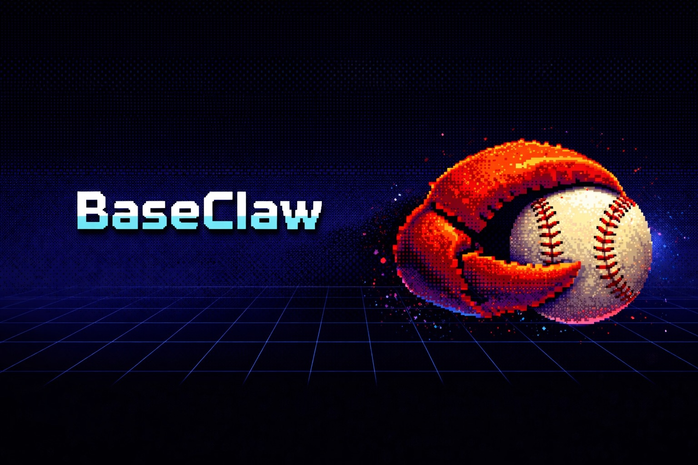

<p align="center">
  
</p>

# BaseClaw

Your fantasy baseball team, managed by AI.

BaseClaw is an MCP server that gives Claude full access to your Yahoo Fantasy Baseball league — your roster, the waiver wire, Statcast data, trade analytics, and 113 tools to act on it all. Ask questions in plain English or let an autonomous agent run your team on autopilot.

## Table of Contents

- [What It Does](#what-it-does)
- [Quick Start](#quick-start)
- [Agent Orchestrators (OpenClaw)](#agent-orchestrators-openclaw)
- [MCP Tools](#mcp-tools)
- [CLI Commands](#cli-commands)
- [Architecture](#architecture)
- [Environment Variables](#environment-variables)
- [Optional Config Files](#optional-config-files)
- [Project Files](#project-files)

## What It Does

> "Who should I pick up this week to help my batting average?"

Just ask. Claude pulls your roster, checks your weak categories, scores every free agent, and recommends the best pickup — with specific stat reasoning.

```
You: "Should I drop Player X for Player Y?"

Claude calls:
  1. yahoo_roster          → your current roster + intel overlays
  2. yahoo_category_check  → your weak/strong categories
  3. yahoo_value (X)       → Player X z-score breakdown
  4. yahoo_value (Y)       → Player Y z-score breakdown
  5. yahoo_category_simulate → projected category rank changes

Claude synthesizes all 5 results and gives you a recommendation
with specific category-level reasoning.
```

More things you can ask:
- "Is it worth trading Soto for two mid-tier pitchers?"
- "Set my lineup for today — bench anyone without a game"
- "Who are the best streaming pitchers for next week?"
- "Scout my opponent this week — where can I beat them?"

Or go fully autonomous. Connect to an agent orchestrator like [OpenClaw](https://openclaw.com) and your team manages itself:
- Daily: auto-sets optimal lineups, checks injuries, handles IL moves
- Weekly: scouts your matchup opponent, finds waiver wire targets, identifies trade opportunities
- On schedule: cron jobs trigger the agent at times you choose — no manual interaction needed
- Smart decisions: the agent follows configurable rules — auto-executes safe moves (lineup optimization), reports risky ones (trades) for your approval

Claude decides which tools to call based on your question. Complex questions chain 3-8 tool calls. Simple lookups are a single call.

<details>
<summary><strong>Under the Hood</strong></summary>

1. **Yahoo Fantasy API** — Your roster, standings, matchups, free agents, transactions, and league settings come from Yahoo's OAuth API in real time. Every tool call fetches current data, not cached snapshots.

2. **Analytics engine** — Z-score valuations tuned to your league's stat categories, powered by consensus projections (Steamer + ZiPS + Depth Charts blended) auto-fetched from FanGraphs, with park factor adjustments, rest-of-season valuation tracking, and in-season blending of projections + live stats weighted by games played. Category gap analysis, punt strategy advisor, playoff path planner, trade package builder, FAAB bid recommendations, and a trade finder that scans every team for complementary deals.

3. **Player intelligence** — Every player surface is enriched with Statcast data (xwOBA, xERA, exit velocity, barrel rate, percentile rankings, pitch arsenal, batted ball profile), platoon splits (vs LHP/RHP), historical Statcast comparisons, arsenal change detection, recent trend splits (7/14/30 day), plate discipline metrics (FanGraphs), Reddit sentiment from r/fantasybaseball, and MLB transaction alerts. Expensive API calls are cached with configurable TTL. Before the season starts, Savant data automatically falls back to the prior year so intel surfaces stay populated during spring training.

4. **Browser automation** — Write operations (add, drop, trade, lineup changes) use Playwright to automate the Yahoo Fantasy website directly, since Yahoo's API no longer grants write scope to new developer apps. Read operations still use the fast OAuth API.

5. **Inline UI apps** — Tool results aren't just text. Nine Preact + Tailwind + Recharts HTML apps with 62 views render interactive tables, charts, radar plots, heatmaps, and dashboards directly inside Claude's response using MCP Apps (`@modelcontextprotocol/ext-apps`).

6. **Workflow tools for agents** — Eleven aggregated tools (`yahoo_morning_briefing`, `yahoo_game_day_manager`, `yahoo_trade_pipeline`, etc.) each combine 5-7+ individual API calls server-side and return concise, decision-ready output in a single tool call. Designed for autonomous agents that need to minimize token usage and tool call count — a full daily routine takes just 2-3 tool calls instead of 15+.

</details>

## Quick Start

**Prerequisites:** Docker and `docker compose`

```bash
curl -fsSL https://raw.githubusercontent.com/jweingardt12/baseclaw/main/scripts/install.sh | bash
```

The installer pulls the Docker image, prompts for Yahoo API credentials, starts the container, runs OAuth discovery, and configures your MCP client. Or tell your OpenClaw agent: **"install github.com/jweingardt12/baseclaw"**

<details>
<summary><strong>Manual setup</strong></summary>

**1. Get Yahoo API credentials** — Go to [developer.yahoo.com/apps/create](https://developer.yahoo.com/apps/create), create an app with **Fantasy Sports** read permissions and `oob` as the redirect URI.

**2. Configure and run:**

```bash
cp docker-compose.example.yml docker-compose.yml
cp .env.example .env
# Edit .env — set YAHOO_CONSUMER_KEY and YAHOO_CONSUMER_SECRET
mkdir -p config data
docker compose up -d
```

**3. Discover your league** — triggers Yahoo OAuth and finds your league/team IDs:

```bash
./yf discover
```

Copy the printed `LEAGUE_ID` and `TEAM_ID` into `.env`, then `docker compose up -d` to restart.

**4. Connect to Claude** — add to `.mcp.json` (Claude Code) or `claude_desktop_config.json` (Claude Desktop):

```json
{
  "mcpServers": {
    "baseclaw": {
      "command": "docker",
      "args": ["exec", "-i", "baseclaw", "node", "/app/mcp-apps/dist/main.js", "--stdio"]
    }
  }
}
```

Claude Desktop config paths: **macOS** `~/Library/Application Support/Claude/claude_desktop_config.json` · **Windows** `%APPDATA%\Claude\claude_desktop_config.json`

</details>

<details>
<summary><strong>Claude.ai (remote access)</strong></summary>

Claude.ai needs the server reachable over HTTPS. Set `MCP_SERVER_URL` and `MCP_AUTH_PASSWORD` in `.env`, put a reverse proxy (Caddy, nginx, Cloudflare Tunnel, Tailscale Funnel, Pangolin) in front of port 4951, and rebuild with `docker compose up -d`.

In Claude.ai: Settings > Integrations > Add MCP Server > enter `https://your-domain.com/mcp`. You'll be prompted for your password. The MCP server implements OAuth 2.1 — no third-party auth provider needed.

</details>

<details>
<summary><strong>Write operations (optional)</strong></summary>

To let Claude make roster moves (add, drop, trade, set lineup), set `ENABLE_WRITE_OPS=true` in `.env`, rebuild, and set up a browser session:

```bash
./yf browser-login
```

Log into Yahoo in the browser that opens. The session saves to `config/yahoo_session.json` and lasts 2-4 weeks.

</details>

<details>
<summary><strong>Preview dashboard (optional)</strong></summary>

Set `ENABLE_PREVIEW=true` in `.env`, rebuild with `docker compose up -d --build`, then open `http://localhost:4951/preview`. Browse all UI views with mock or live data.

</details>

**Uninstall:** `curl -fsSL https://raw.githubusercontent.com/jweingardt12/baseclaw/main/scripts/install.sh | bash -s -- --uninstall`

## Agent Orchestrators (OpenClaw)

Your team manages itself. Connect BaseClaw to an agent orchestrator and it becomes an autonomous fantasy GM — setting lineups every morning, monitoring injuries, scouting opponents, finding waiver pickups, and identifying trades, all on autopilot.

Any MCP-compatible orchestrator works (OpenClaw, LangChain, CrewAI, etc.). The examples below use [OpenClaw](https://openclaw.com).

### What the Agent Does

**Every morning (9am):** Calls `yahoo_morning_briefing` + `yahoo_auto_lineup` — gets the full picture (injuries, matchup scores, category strategy, waiver targets), optimizes your lineup, and executes critical moves (IL stints, pending trade responses). You get a 2-3 sentence summary.

**Pre-lock (10:30am):** Calls `yahoo_game_day_manager` — weather risks, late scratches, streaming recommendations. Last-minute adjustments before lineups lock.

**Monday (8am):** Calls `yahoo_league_landscape` + `yahoo_matchup_strategy` — standings, playoff projections, and a category-by-category game plan for this week's opponent.

**Tuesday (8pm):** Calls `yahoo_waiver_deadline_prep` — ranks candidates with FAAB bids and simulated category impact. Submits top claims automatically.

**Thursday (9am):** Calls `yahoo_streaming` — finds two-start pitchers and favorable matchups. Adds the best option if it helps.

**Saturday (9am):** Calls `yahoo_roster_health_check` — audits for injured starters not on IL, bust candidates, and off-day issues.

**Sunday (9pm):** Calls `yahoo_weekly_digest` — matchup result, standings movement, key performers. Produces a narrative recap.

**Monthly (1st):** Calls `yahoo_season_checkpoint` — rank, playoff probability, category trajectory, and trade targets.

### Decision Tiers

| Tier | Actions | Agent Behavior |
|------|---------|----------------|
| **Auto-execute** | Lineup optimization, IL moves | Safe and idempotent — acts immediately |
| **Execute + report** | Waiver pickups, streaming adds, obvious drops | High-confidence — acts and tells you what it did |
| **Report + wait** | Trades, dropping starters, large FAAB bids | Recommends but waits for your approval |

Tiers are defined in `AGENTS.md` and customizable to your comfort level.

### Cron Schedule

All times Eastern, configurable in `openclaw-cron-examples.json`:

| Schedule | Task | Tools Called |
|----------|------|-------------|
| Daily 9am | Lineup + briefing | `yahoo_morning_briefing` + `yahoo_auto_lineup` |
| Daily 10:30am | Pre-lock check | `yahoo_game_day_manager` |
| Monday 8am | Matchup plan | `yahoo_league_landscape` + `yahoo_matchup_strategy` |
| Tuesday 8pm | Waiver deadline prep | `yahoo_waiver_deadline_prep` |
| Thursday 9am | Streaming check | `yahoo_streaming` |
| Saturday 9am | Roster audit | `yahoo_roster_health_check` |
| Sunday 9pm | Weekly digest | `yahoo_weekly_digest` |
| 1st of month 10am | Season checkpoint | `yahoo_season_checkpoint` |

### Workflow Tools

Eleven aggregated tools designed for autonomous agents. Each combines 5-7+ individual API calls server-side and returns decision-ready output in a single call. Available to all clients (Claude Code, Claude.ai, orchestrators). See the full list in [MCP Tools > Workflows](#mcp-tools).

<details>
<summary><strong>Setup with OpenClaw</strong></summary>

The one-command installer handles OpenClaw configuration automatically. To set it up manually:

```bash
docker compose up -d
cp openclaw-config.yaml /path/to/openclaw/config/
cp AGENTS.md /path/to/openclaw/config/
cp openclaw-cron-examples.json /path/to/openclaw/config/
```

Edit `openclaw-config.yaml`:

```yaml
agents:
  - id: fantasy-gm
    model: anthropic/claude-sonnet-4-5
    persona: ./AGENTS.md
    mcp_servers:
      - name: baseclaw
        command: docker
        args: [exec, -i, baseclaw, node, /app/mcp-apps/dist/main.js, --stdio]
        env:
          ENABLE_WRITE_OPS: "true"
    schedules: ./openclaw-cron-examples.json
```

- **`persona: ./AGENTS.md`** — Agent persona with league strategy, daily/weekly routines, workflow tools, and decision tiers. Customize to adjust behavior.
- **`ENABLE_WRITE_OPS: "true"`** — Required for roster moves. Without it, the agent can only read and recommend.
- **`schedules`** — Cron job definitions. Edit times, timezone, or tasks in `openclaw-cron-examples.json`.

Start the agent:

```bash
openclaw start
```

Example cron job:

```json
{
  "name": "Daily lineup + morning briefing",
  "schedule": { "kind": "cron", "expr": "0 9 * * *", "tz": "America/New_York" },
  "sessionTarget": "isolated",
  "payload": {
    "kind": "agentTurn",
    "message": "Daily routine. Call yahoo_morning_briefing, then yahoo_auto_lineup. Execute any priority-1 action items. Report actions taken in 2-3 sentences."
  }
}
```

</details>

<details>
<summary><strong>Agent Persona</strong></summary>

The `AGENTS.md` file defines the agent's identity and behavior:

- **League awareness** — Learns your format, team count, scoring categories, and roster rules on first session
- **Strategy principles** — Target close categories, concede lost causes, stream pitchers, monitor closers, trade from surplus
- **Season phases** — Early (build depth, stream aggressively), mid (trade for balance, buy low), late (playoff positioning)
- **Decision trees** — Injury response pipelines, trade search workflows, waiver deadline claim chains
- **FAAB management** — Budget pacing, bid philosophy, emergency reserves
- **Competitive intelligence** — Track rival activity, react to opponent moves, check standings before trades
- **Token efficiency** — Workflow tools over individual tools, concise reports

Customize `AGENTS.md` to adjust strategy, risk tolerance, or reporting style.

</details>

### Health Check

`GET /health` returns `{ ok: true, writes_enabled: bool }` — unauthenticated, for uptime monitoring.

## MCP Tools

113 tools across 10 tool files, each with rich inline HTML UI apps rendered directly in Claude.

<details>
<summary><strong>Roster Management</strong> (16 tools)</summary>

| Tool | Description |
|------|-------------|
| `yahoo_roster` | Show current fantasy roster with positions and eligibility |
| `yahoo_free_agents` | List top free agents (batters or pitchers) |
| `yahoo_search` | Search for a player by name among free agents |
| `yahoo_who_owns` | Check who owns a specific player by player ID |
| `yahoo_percent_owned` | Ownership percentage for specific players across Yahoo |
| `yahoo_add` | Add a free agent to your roster |
| `yahoo_drop` | Drop a player from your roster |
| `yahoo_swap` | Atomic add+drop: add one player and drop another |
| `yahoo_waiver_claim` | Submit a waiver claim with optional FAAB bid |
| `yahoo_waiver_claim_swap` | Submit a waiver claim + drop with optional FAAB bid |
| `yahoo_browser_status` | Check if the browser session for write operations is valid |
| `yahoo_change_team_name` | Change your fantasy team name |
| `yahoo_player_stats` | Player fantasy stats for any period (season, week, date, last 7/14/30 days) |
| `yahoo_waivers` | Players currently on waivers (in claim period, not yet free agents) |
| `yahoo_all_rostered` | All rostered players across the league with team ownership |
| `yahoo_change_team_logo` | Change your fantasy team logo (PNG/JPG image) |

</details>

<details>
<summary><strong>League & Standings</strong> (11 tools)</summary>

| Tool | Description |
|------|-------------|
| `yahoo_standings` | League standings with win-loss records |
| `yahoo_matchups` | Weekly H2H matchup pairings |
| `yahoo_scoreboard` | Live scoring overview for the current week |
| `yahoo_my_matchup` | Detailed H2H matchup with per-category comparison |
| `yahoo_info` | League settings, team info, waiver priority, and FAAB budget |
| `yahoo_transactions` | Recent league transactions (add, drop, trade) |
| `yahoo_stat_categories` | League scoring categories |
| `yahoo_transaction_trends` | Most added and most dropped players across Yahoo |
| `yahoo_league_pulse` | League activity — moves and trades per team |
| `yahoo_power_rankings` | Teams ranked by estimated roster strength |
| `yahoo_season_pace` | Projected season pace, playoff probability, and magic numbers |

</details>

<details>
<summary><strong>In-Season Management</strong> (32 tools)</summary>

| Tool | Description |
|------|-------------|
| `yahoo_lineup_optimize` | Optimize daily lineup (bench off-day players, start active ones) |
| `yahoo_category_check` | Your rank in each stat category vs the league |
| `yahoo_injury_report` | Check roster for injured players and suggest IL moves |
| `yahoo_waiver_analyze` | Score free agents by how much they'd improve your weakest categories |
| `yahoo_streaming` | Recommend streaming pitchers by schedule and two-start potential |
| `yahoo_trade_eval` | Evaluate a trade with value comparison and grade |
| `yahoo_daily_update` | Run all daily checks (lineup + injuries) |
| `yahoo_scout_opponent` | Scout current matchup opponent — strengths, weaknesses, counter-strategies |
| `yahoo_category_simulate` | Simulate category rank impact of adding a player |
| `yahoo_matchup_strategy` | Category-by-category game plan to maximize matchup wins |
| `yahoo_set_lineup` | Move specific player(s) to specific position(s) |
| `yahoo_pending_trades` | View all pending incoming and outgoing trade proposals |
| `yahoo_propose_trade` | Propose a trade to another team |
| `yahoo_accept_trade` | Accept a pending trade |
| `yahoo_reject_trade` | Reject a pending trade |
| `yahoo_whats_new` | Digest of injuries, pending trades, league activity, trending pickups, prospect call-ups |
| `yahoo_trade_finder` | Scan the league for complementary trade partners and suggest packages |
| `yahoo_week_planner` | Games-per-day grid with heatmap for your roster (off-days, two-start pitchers) |
| `yahoo_closer_monitor` | Monitor closer situations — your closers, available closers, saves leaders |
| `yahoo_pitcher_matchup` | Pitcher matchup quality for your SPs based on opponent batting stats |
| `yahoo_roster_stats` | Per-player stat breakdown for your roster (season totals or specific week) |
| `yahoo_faab_recommend` | FAAB bid recommendation based on budget, league spending pace, and player value |
| `yahoo_ownership_trends` | Ownership trend data from season.db — accumulates as you use waiver/trending tools |
| `yahoo_category_trends` | Category rank trends over time with Recharts line chart visualization |
| `yahoo_punt_advisor` | Analyze roster construction and recommend categories to target vs. punt |
| `yahoo_il_stash_advisor` | Cross-reference injury timelines with playoff schedule and player upside |
| `yahoo_optimal_moves` | Multi-move optimizer — best add/drop sequence to maximize net roster z-score |
| `yahoo_playoff_planner` | Calculate category gaps to playoff threshold and recommend specific moves |
| `yahoo_trash_talk` | Generate league-appropriate banter based on matchup context |
| `yahoo_rival_history` | Head-to-head record vs each manager (current season, or all-time with league-history.json) |
| `yahoo_achievements` | Track milestones — best ERA week, longest win streak, most moves |
| `yahoo_weekly_narrative` | Auto-generated weekly recap with category analysis and season story arc |

</details>

<details>
<summary><strong>Valuations</strong> (6 tools)</summary>

| Tool | Description |
|------|-------------|
| `yahoo_rankings` | Top players ranked by z-score value (consensus projections, park-adjusted) |
| `yahoo_compare` | Compare two players side by side with z-score breakdowns |
| `yahoo_value` | Full z-score breakdown for a player across all categories |
| `yahoo_projections_update` | Force-refresh projections from FanGraphs (consensus, steamer, zips, or fangraphsdc) |
| `yahoo_zscore_shifts` | Players whose z-score value has shifted most since draft day (rising/falling) |
| `yahoo_projection_disagreements` | Players where projection systems disagree most — draft sleeper/bust signals |

</details>

<details>
<summary><strong>Draft</strong> (5 tools)</summary>

| Tool | Description |
|------|-------------|
| `yahoo_draft_status` | Current draft status — picks made, your round, roster composition |
| `yahoo_draft_recommend` | Draft pick recommendation with top available hitters and pitchers by z-score |
| `yahoo_draft_cheatsheet` | Draft strategy cheat sheet with round-by-round targets |
| `yahoo_best_available` | Best available players ranked by z-score |
| `yahoo_draft_board` | Visual draft board tracker — grid of picks by team and round |

</details>

<details>
<summary><strong>Intelligence</strong> (8 tools)</summary>

| Tool | Description |
|------|-------------|
| `fantasy_player_report` | Deep-dive Statcast radar chart + SIERA (expected ERA) + platoon splits + arsenal + trends + Reddit buzz |
| `fantasy_breakout_candidates` | Players whose expected stats (xwOBA) exceed actual — positive regression candidates |
| `fantasy_bust_candidates` | Players whose actual stats exceed expected (xwOBA) — negative regression candidates |
| `fantasy_reddit_buzz` | What r/fantasybaseball is talking about — hot posts, trending topics |
| `fantasy_trending_players` | Players with rising buzz on Reddit |
| `fantasy_prospect_watch` | Recent MLB prospect call-ups and roster moves |
| `fantasy_transactions` | Recent fantasy-relevant MLB transactions (IL, call-up, DFA, trade) |
| `yahoo_statcast_history` | Compare a player's Statcast profile now vs. 30/60 days ago |

</details>

<details>
<summary><strong>Analytics & Strategy</strong> (7 tools)</summary>

| Tool | Description |
|------|-------------|
| `fantasy_player_news` | Latest news and updates for a specific player |
| `fantasy_news_feed` | Fantasy-relevant news feed across all players |
| `fantasy_probable_pitchers` | Probable pitchers for upcoming games |
| `fantasy_schedule_analysis` | Schedule-based analysis for streaming and lineup planning |
| `fantasy_category_impact` | Projected category rank impact of a roster move |
| `fantasy_regression_candidates` | Players likely to regress positively or negatively based on advanced stats |
| `fantasy_player_tier` | Player tier classification within position group |

</details>

<details>
<summary><strong>MLB Data</strong> (9 tools)</summary>

| Tool | Description |
|------|-------------|
| `mlb_teams` | List all MLB teams with abbreviations |
| `mlb_roster` | MLB team roster by abbreviation (NYY, LAD, etc.) |
| `mlb_player` | MLB player info by Stats API player ID |
| `mlb_stats` | Player season stats by Stats API player ID |
| `mlb_injuries` | Current MLB injuries across all teams |
| `mlb_standings` | MLB division standings |
| `mlb_schedule` | MLB game schedule (today or specific date) |
| `mlb_draft` | MLB draft picks by year |
| `yahoo_weather` | Real-time weather (temperature, wind, condition) from MLB game feed with risk assessment |

</details>

<details>
<summary><strong>League History</strong> (8 tools)</summary>

| Tool | Description |
|------|-------------|
| `yahoo_league_history` | All-time season results with finish position chart — champions, your finishes, W-L-T records |
| `yahoo_record_book` | All-time records with bar charts — career W-L, best seasons, playoff appearances, #1 draft picks |
| `yahoo_past_standings` | Full standings for a past season with win-loss stacked bar chart |
| `yahoo_past_draft` | Draft picks for a past season with player names |
| `yahoo_past_teams` | Team names, managers, move/trade counts for a past season |
| `yahoo_past_trades` | Trade history for a past season |
| `yahoo_past_matchup` | Matchup results for a specific week in a past season |
| `yahoo_roster_history` | View any team's roster from a past week or specific date |

</details>

<details>
<summary><strong>Workflows</strong> (11 tools)</summary>

Aggregated tools designed for autonomous agents. Each combines 5-7+ individual API calls server-side and returns concise, decision-ready output in a single tool call.

| Tool | Description |
|------|-------------|
| `yahoo_morning_briefing` | Daily briefing: injuries, lineup issues, matchup scores, category strategy, league activity, opponent moves, and waiver targets — replaces 7+ individual tool calls |
| `yahoo_league_landscape` | League intelligence: standings, playoff projections, roster strength, manager activity, transactions, matchup results, and trade opportunities |
| `yahoo_roster_health_check` | Roster audit: injured players in active slots, healthy players on IL, bust candidates, off-day starters — ranked by severity |
| `yahoo_waiver_recommendations` | Best waiver pickups for weak categories with recommended drops and projected category impact |
| `yahoo_auto_lineup` | Auto-optimize lineup: bench off-day players, start active bench players, flag injured starters (write operation) |
| `yahoo_trade_analysis` | Evaluate a trade by player names with z-score values, Statcast intel, and unified recommendation |
| `yahoo_game_day_manager` | Pre-game pipeline: schedule, weather risks, injury check, lineup optimization, and streaming recommendation |
| `yahoo_waiver_deadline_prep` | Pre-deadline waiver analysis with FAAB bid recommendations and simulated category impact |
| `yahoo_trade_pipeline` | End-to-end trade search: complementary partners, package values, category impact, and graded proposals |
| `yahoo_weekly_digest` | End-of-week summary: matchup result, standings, transactions, achievements, and prose narrative |
| `yahoo_season_checkpoint` | Monthly assessment: rank, playoff probability, category trajectory, punt strategy, and trade targets |

</details>

### Write Operations

The following 15 tools require `ENABLE_WRITE_OPS=true`. When `ENABLE_WRITE_OPS=false` (default), these tools are hidden entirely. All except `yahoo_auto_lineup` and `yahoo_optimal_moves` also require a valid browser session.

`yahoo_add`, `yahoo_drop`, `yahoo_swap`, `yahoo_waiver_claim`, `yahoo_waiver_claim_swap`, `yahoo_set_lineup`, `yahoo_propose_trade`, `yahoo_accept_trade`, `yahoo_reject_trade`, `yahoo_browser_status`, `yahoo_change_team_name`, `yahoo_change_team_logo`, `yahoo_auto_lineup`, `yahoo_optimal_moves`, `yahoo_projections_update`

<details>
<summary><strong>CLI Commands</strong></summary>

The `./yf` helper script provides direct CLI access to all functionality:

```
./yf <command> [args]
./yf --json <command> [args]   # JSON output mode for programmatic use
./yf api <endpoint> [params]   # Direct API calls (e.g., yf api /api/rankings)
./yf api-list                  # List all available API endpoints
```

| Category | Commands |
|----------|----------|
| **Setup** | `discover` |
| **League** | `info`, `standings`, `roster`, `fa B/P [n]`, `search <name>`, `add <id>`, `drop <id>`, `swap <add> <drop>`, `matchups [week]`, `scoreboard`, `transactions [type] [n]`, `stat-categories`, `player-stats <name> [period] [week]`, `waivers`, `taken-players [position]`, `roster-history [--week N] [--date YYYY-MM-DD]` |
| **Draft** | `status`, `recommend`, `watch [sec]`, `cheatsheet`, `best-available [B\|P] [n]` |
| **Valuations** | `rankings [B\|P] [n]`, `compare <name1> <name2>`, `value <name>`, `import-csv <file>`, `generate` |
| **In-Season** | `lineup-optimize [--apply]`, `category-check`, `injury-report`, `waiver-analyze [B\|P] [n]`, `streaming [week]`, `trade-eval <give> <get>`, `daily-update`, `roster-stats [--period season\|week] [--week N]` |
| **MLB** | `mlb teams`, `mlb roster <tm>`, `mlb stats <id>`, `mlb schedule`, `mlb injuries` |
| **Browser** | `browser-login`, `browser-status`, `browser-test`, `change-team-name <name>`, `change-team-logo <path>` |
| **API** | `api <endpoint> [key=val]`, `api-list` |
| **Docker** | `build`, `restart`, `shell`, `logs` |

</details>

## Architecture

```
┌─────────────────────────────────────────────────┐
│  Docker Container (baseclaw)                     │
│                                                 │
│  ┌──────────────────┐  ┌─────────────────────┐  │
│  │  Python API       │  │  TypeScript MCP     │  │
│  │  (Flask :8766)    │──│  (Express :4951)    │  │
│  │                   │  │                     │  │
│  │  yahoo_fantasy_api│  │  MCP SDK + ext-apps │  │
│  │  pybaseball       │  │  113 tool defs      │  │
│  │  MLB-StatsAPI     │  │  9 apps / 62 views  │  │
│  │  Playwright       │  │  11 workflow tools  │  │
│  │  CacheManager     │  │  10 tool files      │  │
│  └──────────────────┘  └─────────────────────┘  │
└─────────────────────────────────────────────────┘
         │                        │
    Yahoo Fantasy API        MCP Clients (stdio/HTTP)
    Yahoo Website (browser)  ├── Claude Code / Desktop
    FanGraphs (projections)  ├── Claude.ai (remote)
    Baseball Savant (intel)  └── Agent orchestrators
                                 (OpenClaw, cron-scheduled)
```

- **Read operations**: Yahoo Fantasy OAuth API (fast, reliable)
- **Write operations**: Playwright browser automation against Yahoo Fantasy website
- **Valuations**: Consensus projections (Steamer + ZiPS + Depth Charts) auto-fetched from FanGraphs, park-factor adjusted, blended with live stats in-season (weighted by games played), z-scored against league categories, with rest-of-season tracking and projection disagreement detection
- **Intelligence**: Statcast data with SIERA (expected ERA), platoon splits, arsenal change detection, batted ball profiles, and historical comparison — all cached with configurable TTL
- **MCP Apps**: Inline HTML UIs (Preact + Tailwind + Recharts) rendered directly in Claude via `@modelcontextprotocol/ext-apps`
- **Workflow tools**: 11 aggregated endpoints for autonomous agents — each combines 5-7+ API calls server-side to minimize token usage

**Built with:** [yahoo_fantasy_api](https://github.com/uberfastman/yahoo_fantasy_api) | [pybaseball](https://github.com/jldbc/pybaseball) | [MLB-StatsAPI](https://github.com/toddrob99/MLB-StatsAPI) | [MCP Apps (ext-apps)](https://github.com/anthropics/model-context-protocol/tree/main/packages/ext-apps) | [Playwright](https://playwright.dev/) | [MCP SDK](https://github.com/modelcontextprotocol/typescript-sdk)

## Environment Variables

| Variable | Required | Default | Description |
|----------|----------|---------|-------------|
| `YAHOO_CONSUMER_KEY` | Yes | — | Yahoo app consumer key (from developer.yahoo.com) |
| `YAHOO_CONSUMER_SECRET` | Yes | — | Yahoo app consumer secret |
| `LEAGUE_ID` | Yes | — | Yahoo Fantasy league key (e.g., `469.l.16960`) |
| `TEAM_ID` | Yes | — | Your team key (e.g., `469.l.16960.t.12`) |
| `ENABLE_WRITE_OPS` | No | `false` | Enable write operation tools (add, drop, trade, lineup) |
| `ENABLE_PREVIEW` | No | `false` | Serve the preview dashboard at `/preview` |
| `MCP_SERVER_URL` | For Claude.ai | — | Public HTTPS URL for remote access |
| `MCP_AUTH_PASSWORD` | For Claude.ai | — | Password for the OAuth login page |

The game key changes each MLB season (e.g., `469` for 2026). Run `./yf discover` to find your league and team IDs automatically.

<details>
<summary><strong>Optional Config Files</strong></summary>

- `config/league-history.json` — Map of year to league key for historical records
- `config/draft-cheatsheet.json` — Draft strategy and targets (see `.example`)
- `data/player-rankings-YYYY.json` — Hand-curated player rankings (fallback for valuations engine)

</details>

<details>
<summary><strong>Project Files</strong></summary>

```
baseclaw/
├── docker-compose.yml
├── Dockerfile
├── .env.example
├── yf                              # CLI helper script (with --json and api modes)
├── SKILL.md                        # ClawHub manifest (install metadata + overview)
├── AGENTS.md                       # Agent persona for autonomous GM
├── openclaw-config.yaml            # OpenClaw agent orchestrator config
├── openclaw-cron-examples.json     # Cron schedule (8 jobs)
├── config/
│   ├── yahoo_oauth.json            # OAuth credentials + tokens (gitignored, auto-generated from env vars)
│   ├── yahoo_session.json          # Browser session (gitignored, for write ops)
│   ├── league-history.json         # Optional: historical league keys
│   └── draft-cheatsheet.json       # Optional: draft strategy
├── data/
│   ├── player-rankings-YYYY.json   # Optional: curated rankings
│   ├── projections_hitters.csv     # Auto-fetched consensus projections (gitignored)
│   └── projections_pitchers.csv    # Auto-fetched consensus projections (gitignored)
├── scripts/
│   ├── install.sh                   # One-command installer (curl | bash)
│   ├── api-server.py               # Flask API server (~60 endpoints, workflow + strategy)
│   ├── yahoo-fantasy.py            # League management
│   ├── season-manager.py           # In-season management + strategy engine
│   ├── draft-assistant.py          # Draft day tool
│   ├── yahoo_browser.py            # Playwright browser automation
│   ├── history.py                  # Historical records
│   ├── intel.py                    # Fantasy intelligence (Statcast, splits, arsenal, caching)
│   ├── valuations.py               # Z-score valuation engine (consensus, park factors, ROS tracking)
│   ├── mlb-data.py                 # MLB Stats API helper
│   ├── mlb_id_cache.py             # Player name → MLB ID mapping
│   ├── shared.py                   # Shared utilities (team key detection, name normalization)
│   └── openclaw-skill/             # OpenClaw automation scripts
│       ├── api_client.py           # Shared HTTP client for automation scripts
│       ├── config.py               # AutomationConfig (autonomy levels per action type)
│       ├── config.yaml             # Default autonomy configuration
│       ├── formatter.py            # Message formatter for Telegram/WhatsApp
│       ├── daily-lineup.py         # Cron: morning lineup optimization
│       ├── injury-monitor.py       # Cron: injury auto-response with state tracking
│       ├── waiver-scout.py         # Cron: daily waiver wire recommendations
│       ├── weekly-recap.py         # Cron: end-of-week narrative recap
│       ├── manifest.json           # OpenClaw skill package manifest
│       └── README.md               # Automation setup documentation
└── mcp-apps/                       # TypeScript MCP server + UI apps
    ├── server.ts                   # MCP server setup + tool registration
    ├── main.ts                     # Entry point (stdio + HTTP)
    ├── assets/logo-128.png         # Server icon (pixel-art baseball)
    ├── src/tools/                  # 10 tool files, 108 MCP tools
    ├── src/api/                    # Python API client + type definitions
    └── ui/                         # 9 inline HTML apps, 62 views (Preact + Tailwind + Recharts)
```

</details>
